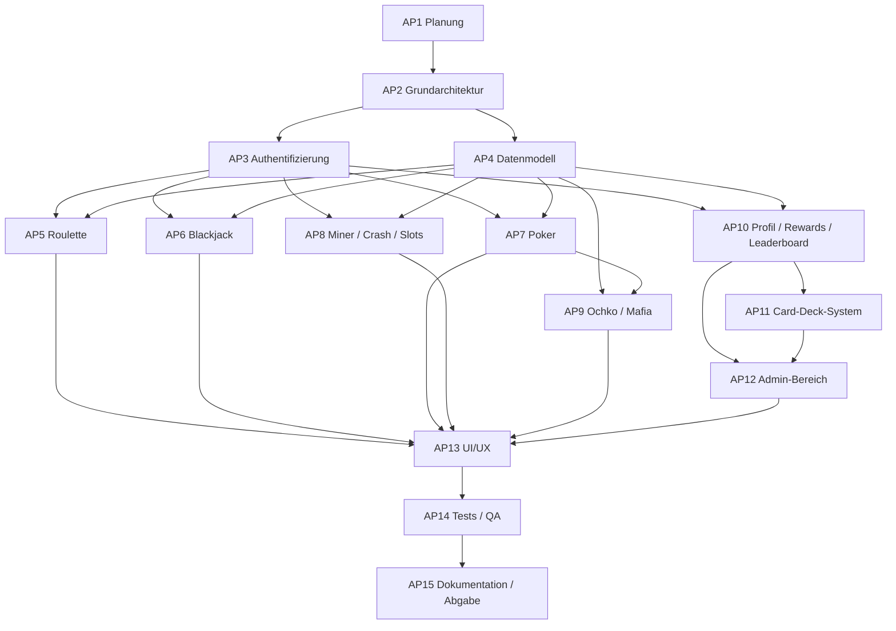

# Arbeitspakete: HTLBets

**Dokumenttyp:** Arbeitspakete  
**Projekt:** HTLBets  
**Version:** 1.0  
**Status:** erstellt  
**Datum:** 22.05.2026

---

## 1. Ziel

Dieses Dokument beschreibt die zentralen Arbeitspakete des Projekts **HTLBets**.  
Es ergänzt die [Aufwandsschaetzung.md](/Users/s1m4/Documents/HTLBets/projektmanagement/Aufwandsschaetzung.md) um eine inhaltliche Struktur und dient als Grundlage für:

- Aufgabenverteilung
- Terminplanung
- Fortschrittskontrolle
- Projektdokumentation

---

## 2. Überblick

Die Arbeitspakete orientieren sich an:

- [Projektauftrag.md](/Users/s1m4/Documents/HTLBets/projektmanagement/Projektauftrag.md)
- [Pflichtenheft.md](/Users/s1m4/Documents/HTLBets/projektmanagement/Pflichtenheft.md)
- [Aufwandsschaetzung.md](/Users/s1m4/Documents/HTLBets/projektmanagement/Aufwandsschaetzung.md)

Die Nummerierung ist bewusst mit der Aufwandsschätzung abgestimmt.

---

## 3. Arbeitspaketliste

## AP1 – Planung, Scope, Projektauftrag

**Ziel:**  
Projektziel, Umfang, Abgrenzung und Rahmenbedingungen festlegen.

**Inhalt:**

- Projektidee beschreiben
- Zielgruppe definieren
- Projektauftrag erstellen
- grobe Risiken und Abgrenzungen festhalten

**Ergebnis:**

- abgestimmter Projektauftrag
- definierter Projektrahmen

**Abhängigkeiten:** keine

**Verantwortung:** Projektteam

---

## AP2 – Grundarchitektur, Projektsetup, Workspaces, Docker

**Ziel:**  
Technische Basis für Frontend, Backend und lokale Entwicklung bereitstellen.

**Inhalt:**

- Repository-Struktur
- npm-Workspaces
- Angular- und Express-Grundsetup
- Docker-Compose für PostgreSQL
- gemeinsame Dev-Startlogik

**Ergebnis:**

- lauffähiges Grundsystem
- lokaler Start mit `npm run dev`

**Abhängigkeiten:** AP1

**Verantwortung:** Projektteam

---

## AP3 – Authentifizierung und Benutzerzugang

**Ziel:**  
Benutzerzugang über Schul-E-Mail mit Verifikation und Passwort-Login umsetzen.

**Inhalt:**

- E-Mail-basierter Einstieg
- Verifikationscode-Flow
- Passwort setzen
- Passwort-Login
- Schutz geschützter Bereiche

**Ergebnis:**

- funktionierender Login-Prozess
- geschützte Benutzerbereiche

**Abhängigkeiten:** AP2

**Verantwortung:** Backend + Frontend

---

## AP4 – Datenmodell, Prisma, Migrationen

**Ziel:**  
Relationale Datenbasis für Benutzer-, Spiel- und Verwaltungsdaten bereitstellen.

**Inhalt:**

- Prisma-Schema
- Datenbanktabellen
- Migrationen
- Basisdatenmodell für Spiele und Historie

**Ergebnis:**

- konsistentes Datenmodell
- reproduzierbare Migrationen

**Abhängigkeiten:** AP2

**Verantwortung:** Backend

---

## AP5 – Roulette

**Ziel:**  
Realtime-Roulette mit gemeinsamem Tischzustand umsetzen.

**Inhalt:**

- Tischzustand
- Einsatzlogik
- serverseitige Auswertung
- Anzeige im Frontend

**Ergebnis:**

- spielbares Roulette

**Abhängigkeiten:** AP3, AP4

**Verantwortung:** Frontend + Backend

---

## AP6 – Blackjack

**Ziel:**  
Einzelspieler-Blackjack gegen den Dealer umsetzen.

**Inhalt:**

- Kartenlogik
- Dealer-Verhalten
- Einsatz und Ergebnis
- Frontend-Darstellung

**Ergebnis:**

- spielbarer Blackjack-Modus

**Abhängigkeiten:** AP3, AP4

**Verantwortung:** Frontend + Backend

---

## AP7 – Poker mit öffentlichen / privaten Tischen

**Ziel:**  
Mehrspieler-Poker mit Tisch- und Sitzlogik bereitstellen.

**Inhalt:**

- Tisch-Erstellung
- öffentliche/private Tische
- Sitz- und Zuschauerlogik
- Spielablauf
- Realtime-Synchronisation

**Ergebnis:**

- spielbarer Poker-Mehrspielermodus

**Abhängigkeiten:** AP3, AP4, AP2

**Verantwortung:** Frontend + Backend

---

## AP8 – Miner, Crash und Slots

**Ziel:**  
Drei zusätzliche Minigames in die Plattform integrieren.

**Inhalt:**

- Miner-Spielmodus
- Crash-Logik
- Slots-Logik
- UI und Ergebnisdarstellung

**Ergebnis:**

- drei spielbare Zusatzmodi

**Abhängigkeiten:** AP3, AP4

**Verantwortung:** Frontend + Backend

---

## AP9 – Ochko und Mafia

**Ziel:**  
Weitere Mehrspieler-Spiele mit Raumlogik und erweiterten Interaktionen umsetzen.

**Inhalt:**

- Ochko-Räume und Kartenspielablauf
- Mafia-Räume
- Rollenlogik
- Text-/Video-Funktionen in Mafia
- Phasensteuerung und Realtime-Status

**Ergebnis:**

- spielbares Ochko
- spielbare Mafia-Demo

**Abhängigkeiten:** AP3, AP4, AP7

**Verantwortung:** Frontend + Backend

---

## AP10 – Profil, Historie, Daily Rewards, Leaderboard

**Ziel:**  
Plattformfunktionen rund um Benutzerprofil, Motivation und Verlauf bereitstellen.

**Inhalt:**

- Profilansicht
- Benutzername und Avatar
- persönliche Historie
- Daily Rewards
- Leaderboard

**Ergebnis:**

- vollständiger Plattformbereich neben den Spielen

**Abhängigkeiten:** AP3, AP4

**Verantwortung:** Frontend + Backend

---

## AP11 – Card-Deck-System

**Ziel:**  
Kauf, Besitz und Auswahl von Karten-Designs umsetzen.

**Inhalt:**

- Deck-Katalog
- Kauf von Decks
- Besitzlogik
- Auswahl eines aktiven Decks
- Standard-Deck-Verwaltung

**Ergebnis:**

- nutzbares Deck-System

**Abhängigkeiten:** AP4, AP10

**Verantwortung:** Frontend + Backend

---

## AP12 – Admin-Bereich inkl. Spiel-Verfügbarkeit

**Ziel:**  
Administrationsoberfläche für Benutzer-, Deck- und Spielverwaltung bereitstellen.

**Inhalt:**

- Benutzersuche
- Guthabenanpassung
- Historienansicht
- Sperren / Entsperren
- Wipe / Delete
- Deck-Verwaltung
- Spiel-Verfügbarkeit ein/aus

**Ergebnis:**

- administrativer Kontrollbereich

**Abhängigkeiten:** AP3, AP4, AP10, AP11

**Verantwortung:** Frontend + Backend

---

## AP13 – UI/UX, Responsive Design, Feinschliff

**Ziel:**  
Benutzeroberflächen konsistent, vorführbar und responsive gestalten.

**Inhalt:**

- Lobby-Layout
- Spielseiten-Styling
- mobile Breiten
- visuelle Konsistenz
- UI-Feinschliff

**Ergebnis:**

- präsentationsfähige Oberfläche

**Abhängigkeiten:** parallel zu AP5-AP12

**Verantwortung:** Frontend

---

## AP14 – Tests, Build-Fixes, QA

**Ziel:**  
Qualität und Vorführbarkeit der Anwendung absichern.

**Inhalt:**

- Unit-Tests
- Build-Prüfung
- Fehlerbehebung
- manuelle Testläufe
- Realtime-Checks

**Ergebnis:**

- stabilere Demo-Version

**Abhängigkeiten:** alle Implementierungspakete

**Verantwortung:** Projektteam

---

## AP15 – Dokumentation, Abschluss, Abgabevorbereitung

**Ziel:**  
Projektunterlagen vervollständigen und Abgabe vorbereiten.

**Inhalt:**

- README pflegen
- Projektunterlagen vervollständigen
- Dokumente angleichen
- Abschlusskontrolle
- Präsentation vorbereiten

**Ergebnis:**

- vollständige Abgabeunterlagen

**Abhängigkeiten:** AP1-AP14

**Verantwortung:** Projektteam

---

## 4. Strukturübersicht

---

## 5. Bezug zur Aufwandsschätzung

Die in diesem Dokument beschriebenen Arbeitspakete entsprechen direkt den Paketen aus:

- [Aufwandsschaetzung.md](/Users/s1m4/Documents/HTLBets/projektmanagement/Aufwandsschaetzung.md)

Damit ist sichergestellt, dass:

- inhaltliche Struktur
- Stundenabschätzung
- Planungslogik

zueinander passen.

---

## 6. Änderungsverlauf

| Version | Datum | Änderung |
|---|---|---|
| 1.0 | 22.05.2026 | Erstfassung der Arbeitspakete erstellt |
