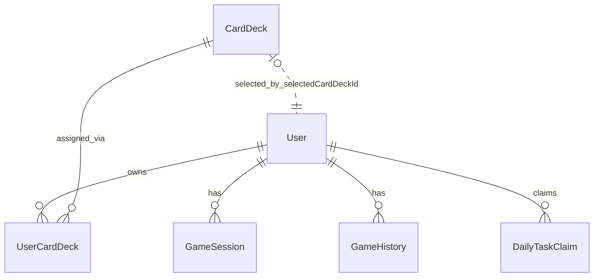

# HTL Bets Datenkatalog

## Überblick

Dieser Datenkatalog beschreibt die zentralen Datenobjekte der aktuellen HTL-Bets-Datenbank auf Basis von `server/prisma/schema.prisma`.

Die Datenbank deckt im Moment folgende fachliche Bereiche ab:

- Benutzerverwaltung
- Karten-Decks und Besitzverhältnisse
- Spielsessions und Spielhistorie
- tägliche Aufgaben / Rewards
- E-Mail-Verifikation
- aktivierbare Spiele im Katalog

---

## Enums

### `GameType`

| Wert | Bedeutung |
|---|---|
| `ROULETTE` | Roulette |
| `BLACKJACK` | Blackjack |
| `POKER` | Poker |
| `MINER` | Miner |
| `CRASH` | Crash |
| `SLOTS` | Slots |
| `OCHKO` | Ochko |
| `ADMIN` | Admin-/Systemkontext |

### `GameSessionStatus`

| Wert | Bedeutung |
|---|---|
| `IDLE` | Session ist angelegt, aber aktuell inaktiv |
| `WAITING_ACTION` | Session wartet auf eine Benutzeraktion |
| `COMPLETED` | Session bzw. Spielrunde ist abgeschlossen |

---

## Entitäten

## `User`

**Zweck:**  
Speichert Stammdaten, Login-Daten, Profilinformationen und Guthaben eines Benutzers.

| Feld | Typ | Schlüssel / Regeln | Beschreibung |
|---|---|---|---|
| `id` | `String` | PK | Eindeutige Benutzer-ID |
| `email` | `String` | `UNIQUE` | Eindeutige E-Mail-Adresse |
| `username` | `String?` | optional | Anzeigename des Benutzers |
| `avatarUrl` | `String?` | optional | Profilbild-URL |
| `selectedCardDeckId` | `String` | Default: `"classic-dark"` | Aktuell ausgewähltes Karten-Deck |
| `bannedAt` | `DateTime?` | optional | Zeitpunkt einer Sperrung |
| `passwordHash` | `String?` | optional | Passwort-Hash |
| `lastDailyLoginAt` | `String?` | optional | Letzter Daily-Login-Tag |
| `balance` | `BigInt` | Default: `1000` | Aktuelles Guthaben |
| `createdAt` | `DateTime` | Default: `now()` | Erstellungszeitpunkt |
| `updatedAt` | `DateTime` | `@updatedAt` | Letzte Änderung |

**Beziehungen:**

- `1:n` zu `GameSession`
- `1:n` zu `GameHistory`
- `1:n` zu `DailyTaskClaim`
- `1:n` zu `UserCardDeck`

**Hinweis:**  
`selectedCardDeckId` wirkt fachlich wie eine Referenz auf `CardDeck.id`, ist im aktuellen Schema aber **keine echte Prisma-Relation**.

---

## `CardDeck`

**Zweck:**  
Beschreibt verfügbare Karten-Designs, die im Spiel bzw. Shop verwendet werden.

| Feld | Typ | Schlüssel / Regeln | Beschreibung |
|---|---|---|---|
| `id` | `String` | PK | Eindeutige Deck-ID |
| `name` | `String` | Pflicht | Name des Decks |
| `price` | `Int` | Pflicht | Preis des Decks |
| `backImageUrl` | `String` | Pflicht | Bild für Kartenrückseite |
| `faceImageTemplate` | `String` | Default gesetzt | Template für Karten-Vorderseiten |
| `isDefault` | `Boolean` | Default: `false` | Standard-Deck |
| `enabled` | `Boolean` | Default: `true` | Gibt an, ob das Deck verfügbar ist |
| `createdAt` | `DateTime` | Default: `now()` | Erstellungszeitpunkt |
| `updatedAt` | `DateTime` | `@updatedAt` | Letzte Änderung |

**Beziehungen:**

- `1:n` zu `UserCardDeck`

---

## `UserCardDeck`

**Zweck:**  
Zwischentabelle für das Besitzverhältnis zwischen Benutzern und Karten-Decks.

| Feld | Typ | Schlüssel / Regeln | Beschreibung |
|---|---|---|---|
| `id` | `String` | PK | Eindeutige Zuordnungs-ID |
| `userId` | `String` | FK -> `User.id` | Zugehöriger Benutzer |
| `deckId` | `String` | FK -> `CardDeck.id` | Zugehöriges Deck |
| `createdAt` | `DateTime` | Default: `now()` | Zeitpunkt des Erwerbs / der Zuordnung |

**Regeln:**

- Kombination `userId + deckId` ist eindeutig

**Beziehungen:**

- `n:1` zu `User`
- `n:1` zu `CardDeck`

---

## `EmailVerificationCode`

**Zweck:**  
Speichert E-Mail-Verifikationscodes für Registrierung oder Verifikation.

| Feld | Typ | Schlüssel / Regeln | Beschreibung |
|---|---|---|---|
| `id` | `String` | PK | Eindeutige ID |
| `email` | `String` | Index | E-Mail-Adresse, für die der Code gilt |
| `codeHash` | `String` | Pflicht | Gehashter Verifikationscode |
| `expiresAt` | `DateTime` | Pflicht | Ablaufzeitpunkt |
| `used` | `Boolean` | Default: `false` | Gibt an, ob der Code bereits verwendet wurde |
| `createdAt` | `DateTime` | Default: `now()` | Erstellungszeitpunkt |

**Besonderheit:**  
Diese Tabelle ist derzeit **nicht relational** mit `User` verbunden, sondern läuft direkt über die E-Mail-Adresse.

---

## `GameSession`

**Zweck:**  
Speichert den aktuellen technischen Zustand einer laufenden Spielsitzung pro Benutzer.

| Feld | Typ | Schlüssel / Regeln | Beschreibung |
|---|---|---|---|
| `id` | `String` | PK | Eindeutige Session-ID |
| `userId` | `String` | FK -> `User.id` | Zugehöriger Benutzer |
| `gameType` | `GameType` | Pflicht | Typ des Spiels |
| `status` | `GameSessionStatus` | Default: `IDLE` | Aktueller Session-Status |
| `currentBet` | `BigInt` | Default: `0` | Aktueller Einsatz |
| `state` | `Json` | Pflicht | Technischer Spielzustand |
| `createdAt` | `DateTime` | Default: `now()` | Erstellungszeitpunkt |
| `updatedAt` | `DateTime` | `@updatedAt` | Letzte Änderung |

**Beziehungen:**

- `n:1` zu `User`

**Besonderheit:**  
Das Feld `state` ist flexibel und enthält spielspezifische JSON-Daten.

---

## `GameHistory`

**Zweck:**  
Speichert abgeschlossene oder protokollierte Spielereignisse für Verlauf, Auswertung und Nachvollziehbarkeit.

| Feld | Typ | Schlüssel / Regeln | Beschreibung |
|---|---|---|---|
| `id` | `String` | PK | Eindeutige History-ID |
| `userId` | `String` | FK -> `User.id` | Zugehöriger Benutzer |
| `gameType` | `GameType` | Pflicht | Spieltyp |
| `betAmount` | `BigInt` | Pflicht | Einsatzhöhe |
| `result` | `String` | Pflicht | Ergebnistext / Status |
| `balanceChange` | `BigInt` | Pflicht | Veränderung des Guthabens |
| `createdAt` | `DateTime` | Default: `now()` | Erstellungszeitpunkt |

**Beziehungen:**

- `n:1` zu `User`

---

## `DailyTaskClaim`

**Zweck:**  
Speichert, welche täglichen Aufgaben von welchem Benutzer an welchem Tag beansprucht wurden.

| Feld | Typ | Schlüssel / Regeln | Beschreibung |
|---|---|---|---|
| `id` | `String` | PK | Eindeutige Claim-ID |
| `userId` | `String` | FK -> `User.id` | Zugehöriger Benutzer |
| `taskKey` | `String` | Pflicht | Kennung der Daily Task |
| `claimDate` | `String` | Pflicht | Datum des Claims |
| `createdAt` | `DateTime` | Default: `now()` | Erstellungszeitpunkt |

**Regeln:**

- Kombination `userId + taskKey + claimDate` ist eindeutig

**Beziehungen:**

- `n:1` zu `User`

---

## `GameCatalogEntry`

**Zweck:**  
Verwaltet, welche Spiele im System verfügbar bzw. deaktiviert sind.

| Feld | Typ | Schlüssel / Regeln | Beschreibung |
|---|---|---|---|
| `id` | `String` | PK | Technische Spiel-ID |
| `name` | `String` | Pflicht | Anzeigename des Spiels |
| `enabled` | `Boolean` | Default: `true` | Gibt an, ob das Spiel aktiv ist |
| `sortOrder` | `Int` | Pflicht | Reihenfolge in Listen / Lobby |
| `createdAt` | `DateTime` | Default: `now()` | Erstellungszeitpunkt |
| `updatedAt` | `DateTime` | `@updatedAt` | Letzte Änderung |

**Besonderheit:**  
Diese Tabelle wird für die Admin-Steuerung der Spielverfügbarkeit verwendet.

---

## Beziehungsübersicht

---

## Fachliche Hinweise

### 1. Direkte Benutzerreferenzen

Die zentrale Entität ist `User`. Fast alle spielbezogenen und reward-bezogenen Daten hängen direkt daran.

### 2. Flexible Spielzustände

`GameSession.state` ist als `Json` modelliert. Das ist praktisch für unterschiedliche Spiele, erschwert aber:

- klassische relationale Auswertungen
- strikte Datenvalidierung auf Datenbankebene
- SQL-basierte Analysen pro Spielzustand

### 3. Karten-Deck-Auswahl

Der Besitz eines Decks ist über `UserCardDeck` modelliert.  
Die aktive Auswahl (`selectedCardDeckId`) ist derzeit allerdings nur als String im `User` gespeichert.

### 4. Spielkatalog

`GameCatalogEntry` ist die Grundlage dafür, Spiele im Admin-Bereich ein- und auszuschalten.

---

## Quelle

Basierend auf:

- [schema.prisma](../server/prisma/schema.prisma)
