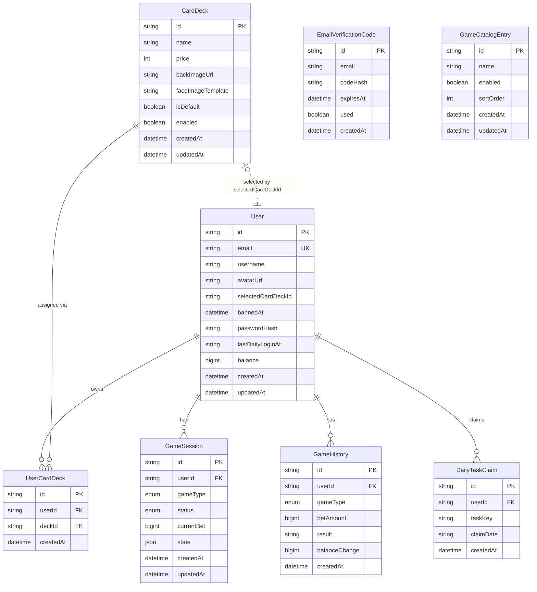

# ER-Diagramm: HTLBets

**Stand:** 09.06.2026

Das Diagramm entspricht dem aktuellen Prisma-Schema. Mafia-Raumzustände werden in-memory verwaltet; Balatro besitzt derzeit keinen persistenten Datenbankzustand.

