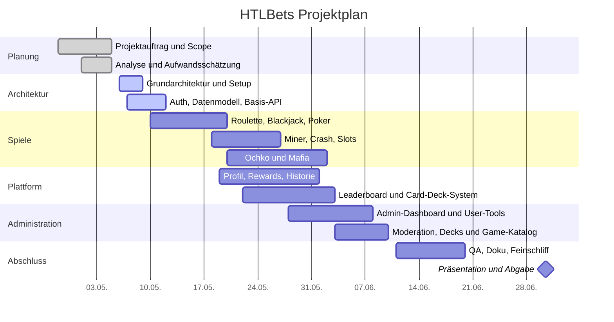

# Gantt-Plan: HTLBets

**Stand:** 22.05.2026  
**Projektzeitraum:** 28.04.2026 bis 30.06.2026

## Übersicht

Der folgende Plan basiert auf dem aktuellen Projektauftrag und bildet die vorgesehenen Phasen, Meilensteine und Abgabetermine für **HTLBets** ab.

## Meilensteine

| Meilenstein | Termin | Inhalt |
|---|---|---|
| Projektauftrag abgestimmt | 28.04.2026 | Projektstart und formeller Auftrag |
| Analyse und Planung abgeschlossen | 05.05.2026 | Anforderungen, Risiken, Aufwand |
| Grundarchitektur steht | 09.05.2026 | Frontend, Backend, DB, Auth-Basis |
| Kernspiele integriert | 20.05.2026 | Roulette, Blackjack, Poker |
| Erweiterte Spiele integriert | 27.05.2026 | Miner, Crash, Slots |
| Weitere Mehrspieler-Spiele integriert | 02.06.2026 | Ochko und Mafia |
| Zusatzfunktionen fertig | 03.06.2026 | Profil, Rewards, Historie, Decks |
| Admin-Funktionen fertig | 10.06.2026 | Suche, Balance, Decks, Moderation |
| Spielkatalog steuerbar | 10.06.2026 | Spiele aktivieren / deaktivieren |
| Abnahmeversion bereit | 20.06.2026 | Vorführbare Gesamtversion |
| Projektabschluss | 30.06.2026 | Präsentation und finale Abgabe |

## Hinweise

- Die Detailtermine können je nach Unterrichtsfortschritt leicht angepasst werden.
- Die Phasen überschneiden sich bewusst, weil Dokumentation, Entwicklung und QA parallel laufen.
- Der Plan berücksichtigt den erweiterten Scope mit Ochko, Mafia und steuerbarer Spiel-Verfügbarkeit.
- Für die finale Abgabe sollten `README`, Projektunterlagen und Build-Status gemeinsam geprüft werden.
