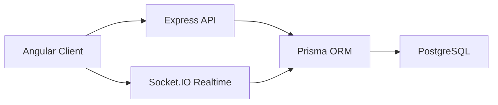
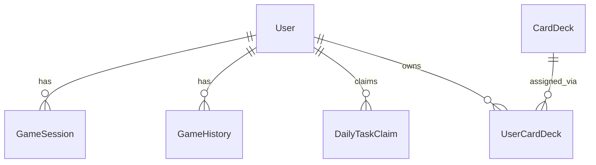

# Pflichtenheft: HTLBets

**Dokumenttyp:** Pflichtenheft  
**Projekt:** HTLBets  
**Version:** 1.1
**Status:** aktualisiert
**Datum:** 09.06.2026

---

## 1. Einleitung

### 1.1 Ziel des Dokuments

Dieses Pflichtenheft beschreibt die fachlichen und technischen Anforderungen an das Projekt **HTLBets**.  
Es ergänzt den [Projektauftrag.md](./Projektauftrag.md) und dient als Grundlage für:

- Umsetzung
- Qualitätssicherung
- Abnahme
- technische Dokumentation

### 1.2 Projektkontext

HTLBets ist eine webbasierte Demo-Minigame-Plattform für HTL-Schüler:innen.  
Die Anwendung verwendet ausschließlich **virtuelle Credits** und dient Unterrichts-, Lern- und Demonstrationszwecken.

Die Plattform umfasst:

- Authentifizierung über Schul-E-Mail
- Benutzerprofil mit Avatar und Historie
- mehrere Minigames
- Leaderboard und Daily Rewards
- Karten-Deck-System
- Admin-Bereich zur Verwaltung von Benutzer:innen, Decks und Spielverfügbarkeit

### 1.3 Abgrenzung

Nicht Bestandteil des Projekts sind:

- Echtgeldfunktionen
- Ein- und Auszahlungen
- rechtliche Zertifizierung für Glücksspielbetrieb
- öffentlicher Masseneinsatz im Produktivbetrieb
- Native Mobile Apps

---

## 2. Produktübersicht

### 2.1 Kurzbeschreibung

HTLBets ist eine Full-Stack-Webanwendung mit Angular-Frontend und Node.js-/Express-Backend.  
Die Anwendung ermöglicht registrierten Benutzer:innen das Spielen mehrerer Demo-Spiele auf Basis virtueller Credits.

### 2.2 Zielgruppe

- Schüler:innen mit berechtigter Schul-E-Mail-Adresse
- Lehrpersonen zur Demonstration des Projekts
- Projektteam zur technischen Umsetzung und Präsentation

### 2.3 Einsatzbereich

- Unterricht
- Projektpräsentation
- Demonstration moderner Webentwicklung mit Echtzeitkommunikation

---

## 3. Produktfunktionen

### 3.1 Benutzer- und Authentifizierungsfunktionen

| ID | Funktion | Beschreibung |
|---|---|---|
| F-01 | E-Mail-Einstieg | Benutzer:innen geben ihre Schul-E-Mail-Adresse ein. |
| F-02 | Code-Verifikation | Beim ersten Login wird ein Verifikationscode per E-Mail verwendet. |
| F-03 | Passwort setzen | Nach erfolgreicher Verifikation kann ein Passwort gesetzt werden. |
| F-04 | Passwort-Login | Spätere Logins erfolgen über Passwort. |
| F-05 | Sitzungsverwaltung | Authentifizierte Benutzer:innen bleiben für geschützte Bereiche angemeldet. |
| F-06 | Sperrung | Gesperrte Benutzer:innen dürfen weder REST- noch Realtime-Zugriffe ausführen. |

### 3.2 Profil- und Credit-Funktionen

| ID | Funktion | Beschreibung |
|---|---|---|
| F-10 | Profilansicht | Anzeige von Benutzername, Avatar und Kontodaten |
| F-11 | Profilbearbeitung | Benutzername und Avatar können geändert werden |
| F-12 | Startguthaben | Neue Accounts erhalten ein definiertes Startguthaben |
| F-13 | Guthabenanzeige | Das aktuelle Guthaben wird im Frontend angezeigt |
| F-14 | Historie | Guthabenänderungen und Spielverläufe werden nachvollziehbar gespeichert |
| F-15 | Daily Rewards | Tägliche Aufgaben und Belohnungen sind verfügbar |
| F-16 | Leaderboard | Ranglistenansichten für definierte Metriken sind verfügbar |

### 3.3 Spiel-Funktionen

| ID | Spiel / Modul | Beschreibung |
|---|---|---|
| F-20 | Roulette | Realtime-Roulette mit gemeinsamem Tischzustand |
| F-21 | Blackjack | Spielbarer Einzelspielmodus gegen den Dealer |
| F-22 | Poker | Multiplayer-Poker mit öffentlichen und privaten Tischen |
| F-23 | Miner | Spielbarer Demo-Minigame-Modus |
| F-24 | Crash | Realtime-/Rundenlogik mit Cashout-Mechanik |
| F-25 | Slots | Spielbarer Slot-Demo-Modus |
| F-26 | Ochko | Multiplayer-Kartenspiel mit Raumlogik |
| F-27 | Mafia | Multiplayer-Spiel mit Rollen, Raumlogik, Text/Video und Phasensteuerung |
| F-28 | Balatro | Clientseitiger Einzelspielmodus mit Blinds, Pokerhand-Wertung, Jokern, Consumables und Shop |

### 3.4 Karten-Deck-Funktionen

| ID | Funktion | Beschreibung |
|---|---|---|
| F-30 | Deck-Katalog | Benutzer:innen können verfügbare Karten-Decks einsehen |
| F-31 | Deck-Kauf | Karten-Decks können mit virtuellen Credits gekauft werden |
| F-32 | Deck-Auswahl | Ein eigenes Deck kann aktiv ausgewählt werden |
| F-33 | Default-Deck | Ein Standard-Deck ist systemweit definiert |

### 3.5 Admin-Funktionen

| ID | Funktion | Beschreibung |
|---|---|---|
| F-40 | Benutzersuche | Admins können Benutzer:innen suchen und anzeigen |
| F-41 | Guthaben ändern | Admins können Guthaben setzen / anpassen |
| F-42 | Decks vergeben | Admins können Karten-Decks an Benutzer:innen vergeben |
| F-43 | Benutzer sperren | Admins können Accounts sperren oder entsperren |
| F-44 | Benutzer zurücksetzen | Wipe von Spielzuständen und Verlauf |
| F-45 | Benutzer löschen | Vollständige Entfernung eines Kontos |
| F-46 | Deck-Verwaltung | Import, Standard-Deck, Aktivierung |
| F-47 | Spiel-Verfügbarkeit | Spiele können aktiviert / deaktiviert werden |

---

## 4. Benutzerrollen

| Rolle | Rechte |
|---|---|
| Gast | Zugriff auf Login-/Verifikationsseiten |
| Benutzer:in | Zugriff auf Lobby, Spiele, Profil, Historie, Rewards |
| Admin | Zugriff auf Admin-Bereich und Verwaltungsfunktionen |

---

## 5. Anwendungsfälle

### 5.1 Registrierung / erster Einstieg

1. Benutzer:in gibt Schul-E-Mail ein.
2. System prüft Berechtigung und Login-Status.
3. Verifikationscode wird angefordert.
4. Benutzer:in bestätigt den Code.
5. Passwort wird gesetzt.
6. Zugang zur Plattform wird freigeschaltet.

### 5.2 Regulärer Login

1. Benutzer:in gibt E-Mail ein.
2. System erkennt bestehendes Passwort.
3. Passwort wird eingegeben.
4. Zugang zur Plattform wird freigeschaltet.

### 5.3 Spielnutzung

1. Benutzer:in betritt die Lobby.
2. Ein Spiel oder Raum wird ausgewählt.
3. Aktionen werden über Frontend ausgelöst.
4. Backend validiert Einsatz, Spielzustand und Ergebnis.
5. Guthaben und Verlauf werden aktualisiert.

### 5.4 Admin-Verwaltung

1. Admin öffnet den Admin-Bereich.
2. Benutzer:innen, Decks oder Spiele werden ausgewählt.
3. Verwaltungsaktion wird ausgelöst.
4. Backend validiert Berechtigung und schreibt Änderungen.

---

## 6. Nichtfunktionale Anforderungen

### 6.1 Allgemeine Qualitätsanforderungen

| ID | Anforderung | Beschreibung |
|---|---|---|
| NF-01 | Bedienbarkeit | Die Anwendung soll auf Desktop und mobilen Breiten nutzbar sein. |
| NF-02 | Verständlichkeit | Oberflächen sollen klar strukturiert und vorführbar sein. |
| NF-03 | Wartbarkeit | Frontend und Backend sollen modular aufgebaut sein. |
| NF-04 | Nachvollziehbarkeit | Guthabenänderungen und wesentliche Aktionen sollen nachvollziehbar sein. |
| NF-05 | Sicherheit | Spiel- und Balance-Logik muss serverseitig validiert werden. |

### 6.2 Leistungsanforderungen

| ID | Anforderung | Beschreibung |
|---|---|---|
| NF-10 | Lokale Vorführbarkeit | Anwendung muss lokal mit `npm run dev` startbar sein. |
| NF-11 | Build-Fähigkeit | `npm run build` soll erfolgreich durchlaufen. |
| NF-12 | Testbarkeit | Vorhandene Tests sollen lokal ausführbar sein. |
| NF-13 | Realtime-Konsistenz | Gemeinsame Spielzustände müssen für alle Teilnehmenden konsistent übertragen werden. |

### 6.3 Sicherheitsanforderungen

| ID | Anforderung | Beschreibung |
|---|---|---|
| NF-20 | Authentifizierung | Geschützte Bereiche erfordern gültige Anmeldung. |
| NF-21 | Admin-Schutz | Admin-Funktionen dürfen nur für Admin-Accounts verfügbar sein. |
| NF-22 | Sperrlogik | Gesperrte Benutzer:innen dürfen keine Spielaktionen ausführen. |
| NF-23 | Keine Echtgeldfunktion | Die Plattform darf keine Zahlungs- oder Auszahlungslogik enthalten. |

---

## 7. Systemarchitektur

## 7.1 Architekturüberblick

HTLBets verwendet eine klassische Webarchitektur mit getrenntem Frontend und Backend.

### 7.2 Technologiestack

| Ebene | Technologie |
|---|---|
| Frontend | Angular 21 |
| Backend | Express + TypeScript |
| Realtime | Socket.IO |
| Datenbank | PostgreSQL |
| ORM | Prisma |
| Lokale Infrastruktur | npm Workspaces + Docker Compose |

### 7.3 Architektureigenschaften

- serverseitige Validierung von Spielzuständen
- REST für Stammdaten und Verwaltungsfunktionen
- Socket.IO für Realtime-Spiele und Mehrspielerlogik
- relationale Datenhaltung für Benutzer- und Verlaufsdaten
- JSON-basierte Spielzustände in `GameSession`

---

## 8. Datenmodell

Das aktuelle Datenmodell umfasst insbesondere:

- `User`
- `CardDeck`
- `UserCardDeck`
- `EmailVerificationCode`
- `GameSession`
- `GameHistory`
- `DailyTaskClaim`
- `GameCatalogEntry`

Weiterführende Dokumente:

- [Datenkatalog.md](./Datenkatalog.md)
- [ER-Diagramme.md](./ER-Diagramme.md)

### 8.1 Zentrale Beziehungen

### 8.2 Besondere Modellierungsentscheidung

Der laufende technische Spielzustand wird in `GameSession.state` als `Json` gespeichert.  
So lassen sich unterschiedliche Spielmodi flexibel abbilden, ohne für jedes Spiel ein eigenes relationales Zustandsmodell anzulegen.

---

## 9. Schnittstellen

## 9.1 REST-Schnittstellen

### Auth

- `POST /api/auth/begin`
- `POST /api/auth/request-code`
- `POST /api/auth/verify-code`
- `POST /api/auth/login-password`
- `POST /api/auth/set-password`

### Benutzerbereich

- `GET /api/me`
- `PATCH /api/me/profile`
- `GET /api/history`
- `GET /api/me/dailies`
- `POST /api/me/dailies/:taskKey/claim`
- `GET /api/me/card-decks`
- `POST /api/me/card-decks/:deckId/purchase`
- `POST /api/me/card-decks/:deckId/select`
- `GET /api/leaderboard`
- `GET /api/game-catalog`

### Admin-Bereich

- `GET /api/admin/users`
- `GET /api/admin/users/:userId/history`
- `PATCH /api/admin/users/:userId/balance`
- `GET /api/admin/users/:userId/card-decks`
- `POST /api/admin/users/:userId/card-decks/:deckId/grant`
- `POST /api/admin/users/:userId/ban`
- `POST /api/admin/users/:userId/wipe`
- `DELETE /api/admin/users/:userId`
- `GET /api/admin/card-decks`
- `POST /api/admin/card-decks/import`
- `POST /api/admin/card-decks/:deckId/default`
- `GET /api/admin/games`
- `PATCH /api/admin/games/:gameId`

## 9.2 Realtime-Schnittstellen

Die Mehrspieler- und Realtime-Funktionen werden über Socket.IO umgesetzt.

Wesentliche Realtime-Bereiche:

- Join / Leave von Spielräumen
- Bet- und Action-Events
- gemeinsame Zustandsupdates
- Realtime-Tischzustände für Roulette, Poker, Mafia, Ochko und Crash
- Media-Signaling für Poker und Mafia

---

## 10. Benutzeroberfläche

### 10.1 Hauptseiten

| Bereich | Zweck |
|---|---|
| Login / Verifikation | Einstieg und Authentifizierung |
| Lobby | Zentrale Übersicht über Spiele |
| Spielseiten | UI pro Spielmodus |
| Leaderboard | Ranglistenansichten |
| Profil | Benutzerprofil, Historie, Rewards, Decks |
| Admin | Verwaltungsoberfläche |

### 10.2 Routing

Das Frontend umfasst unter anderem folgende Hauptpfade:

- `/lobby`
- `/games/roulette`
- `/games/blackjack`
- `/games/poker`
- `/games/miner`
- `/games/crash`
- `/games/slots`
- `/games/ochko`
- `/games/mafia`
- `/games/balatro`
- `/games/leaderboard`
- `/profile`
- `/admin`

### 10.3 UI-Anforderungen

- dunkles, modernes, mobile-taugliches Interface
- klare Navigation zwischen Lobby, Spielen und Profil
- visuelle Rückmeldung bei Realtime-Zuständen
- Admin-Bereich klar vom normalen Benutzerbereich getrennt

---

## 11. Spielbezogene Anforderungen

### 11.1 Allgemein

- Spielaktionen dürfen nie ausschließlich clientseitig entschieden werden.
- Guthabenänderungen müssen serverseitig berechnet und gespeichert werden.
- Mehrspielerzustände müssen für alle Teilnehmer:innen konsistent sein.

Ausnahme: Balatro ist ein isolierter Demo-Einzelspielmodus. Seine Run-Währung und sein Spielzustand sind nicht mit dem persistenten Benutzer:innen-Guthaben verbunden.

### 11.2 Poker

- öffentliche und private Tische
- Sitz- und Zuschauerlogik
- Realtime-Status
- optionale Kamera-/Audiofunktionen für sitzende Spieler:innen

### 11.3 Mafia

- öffentliche und private Räume
- konfigurierbare Rollen beim Erstellen
- spielbare Phasenlogik
- optionale Text- und Video-Funktion
- rollenspezifische Sichtbarkeit in Intro-/Nachtphasen

### 11.4 Roulette

- gemeinsamer Tischzustand
- serverseitige Auswertung von Einsätzen
- visuelle Darstellung des Tisches und des Rads

### 11.5 Balatro

- Auswahl und Abschluss aufeinanderfolgender Blinds
- Wertung klassischer Pokerhände
- begrenzte Hände und Discards pro Blind
- Joker-, Consumable- und Shop-System
- interne Run-Währung ohne Auswirkung auf das persistierte Benutzer:innen-Guthaben

---

## 12. Testkonzept

### 12.1 Testarten

| Testart | Zweck |
|---|---|
| Unit Tests | Prüfung einzelner Services, Pipes und Logik |
| Build-Test | Sicherstellen, dass Client und Server kompilieren |
| Manuelle UI-Tests | Prüfung von Layout, Navigation und Spielabläufen |
| Realtime-Tests | Prüfung konsistenter Mehrspielerzustände |

### 12.2 Mindestprüfungen

Vor einer vorführbaren Abgabe sollen mindestens folgende Prüfungen erfolgreich sein:

- `npm run build`
- `npm run test`
- Login-Flows prüfen
- Admin-Zugriff prüfen
- zentrale Spielmodi manuell testen

---

## 13. Abnahmekriterien

Das Pflichtenheft gilt als erfüllt, wenn:

1. die Anwendung lokal startbar ist,
2. die Authentifizierung mit Schul-E-Mail funktioniert,
3. Guthaben, Historie und Profil nutzbar sind,
4. die im Projektauftrag definierten Spielmodi erreichbar und vorführbar sind,
5. Admin-Funktionen verfügbar und geschützt sind,
6. keine Echtgeld- oder Zahlungslogik vorhanden ist,
7. Build und vorhandene Tests ohne kritische Fehler laufen,
8. die Projektdokumentation im Repository vorliegt.

---

## 14. Offene technische Grenzen

Folgende Punkte sind bewusst als Projekt- bzw. Demo-Grenzen zu verstehen:

- keine Produktiv-Glücksspielplattform
- keine rechtliche oder regulatorische Zertifizierung
- begrenzte Skalierung bei Peer-to-Peer-Video in Mafia/Poker
- keine hochverfügbare Betriebsinfrastruktur

---

## 15. Referenzen

- [Projektauftrag.md](./Projektauftrag.md)
- [Projektstatus.md](./Projektstatus.md)
- [Datenkatalog.md](./Datenkatalog.md)
- [ER-Diagramme.md](./ER-Diagramme.md)
- [README.md](../README.md)

---

## 16. Änderungsverlauf

| Version | Datum | Änderung |
|---|---|---|
| 1.0 | 19.05.2026 | Erstfassung des Pflichtenhefts erstellt |
| 1.1 | 09.06.2026 | Balatro, aktuelles Routing und technische Abgrenzung ergänzt |
