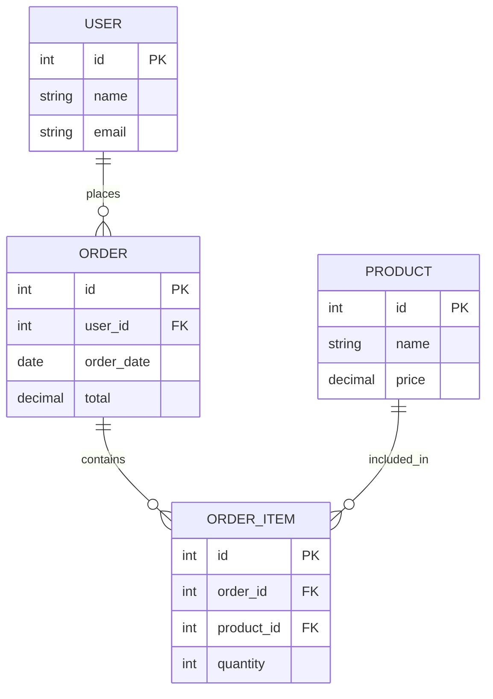

```mermaid
erDiagram
    USER {
        int id PK
        string name
        string email
    }

    ORDER {
        int id PK
        int user_id FK
        date order_date
        decimal total
    }

    PRODUCT {
        int id PK
        string name
        decimal price
    }

    ORDER_ITEM {
        int id PK
        int order_id FK
        int product_id FK
        int quantity
    }

    USER ||--o{ ORDER : places
    ORDER ||--o{ ORDER_ITEM : contains
    PRODUCT ||--o{ ORDER_ITEM : included_in
```
